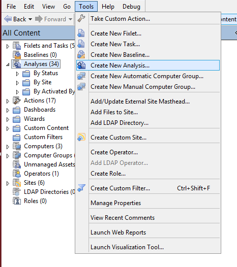

Equivalent Action in Console
---
* Right-click an Analysis and select "Create New Analysis.."


* Or, from Menu bar, select "Tool", then choose "Create New Analysis..."



Explanation of [`analysis.xml`](./analysis.xml)
---
* Title - (Permissible Values: any string) The title of your custom analysis
* Description - (Permissible Values: any string)The updated description of your custom analysis
* Relevance - (Permissible Values: any relevance expression that evaluates to true or false) A relevance statement that evaluates to true for computers that this Fixlet should run on. All Relevance tags must evaluate to `true` in order for the Fixlet to run. 
* Source - (Optional, default to `""`) (Permissible Values: any string)
* SourceReleaseDate - (Optional, default to the date of sourse release) (Permissible Values: a date in `yyyy-mm-dd` format)
* MIMEField - (Optional, default to
  ```
     </MIMEField>
         <Name>x-fixlet-modification-time</Name>
         <Value>TIME WHEN CREATED</Value>
     </MIMEField>
  ```
* Domain - (Optional)
* Proprety - (Optional) (Permissible Values: an existed property name) Name of the property that is analyzed. (When adding a new property, increase its ID in the new tag, eg.`<Property Name="New Property2" ID="2">local time zone</Property>`)

Usage
---

This command will POST the file [`analysis.xml`](./analysis.xml) to the server to create a new analysis called `My Custom Analysis' for a custom site named `Test-Site`.

    curl -X POST --data-binary @analysis.xml --user username:password https://server:port/api/analyses/custom/Test-Site

See [cURL overview](../../README.md#cURL) for more information on using [cURL](http://curl.haxx.se/).
